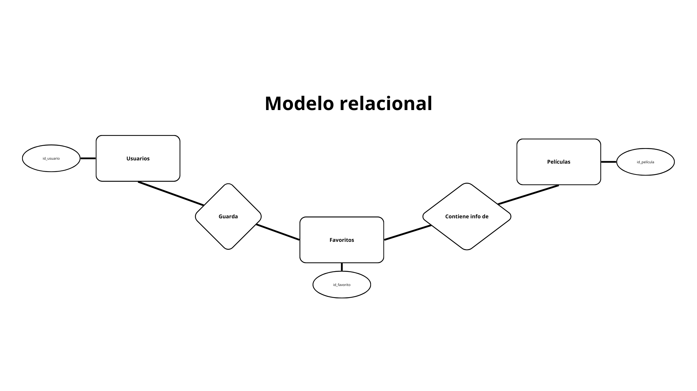
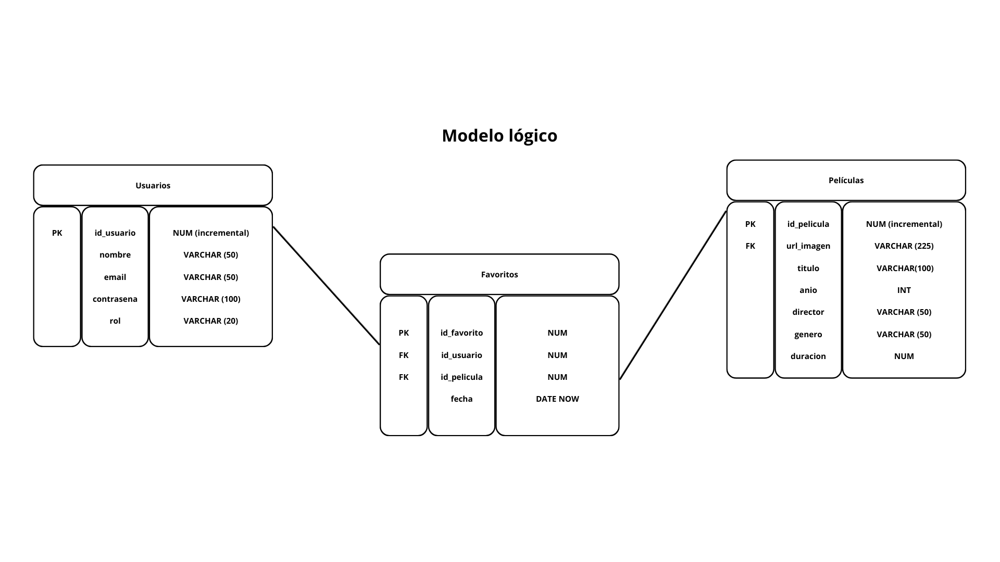

# SERVER PROYECTO MOVIE APP

## DESCRIPCIÓN GENERAL
Aplicación web desarrollada de búsqueda y gestión de películas que engloba diferentes funcionalidades y endpoints asociados.

## TECNOLOGÍAS UTILIZADAS
Para este proyecto se han utilizado las siguientes tecnologías:

1. **SERVER - BACKEND**
    - Node.js
    - Express.js
    - JWT
    - bcrypt

2. **BBDD**
    - PostgreSQL
    - pg

3. **HERRAMIENTAS DE DESARROLLO**
    - Git & GitHub
    - Postman
    - Nodemon

4. **DESPLIEGUE**
    - Render

5. **VALIDACIÓN Y SEGURIDAD**
    - express-validator
    - CORS

6. **ORGANIZACIÓN DEL TRABAJO**
    - Trello

## ARQUITECTURA
```bash
.env.template
init.sql
package-lock.json
package.json
README.md
/src 
    /config - Configuración
    /controllers - Funciones controladoras
    /db - Queries
    /helpers - Funciones ayudadoras
    /middlewares - Funciones de middleware
    /routes - Rutas
    /validators - Funciones validadoras (check)
    /app.js
```

## ROLES DE USUARIO
Se diferencian dos roles de usuario:
    - **Admin:** Rol que gestiona las funciones relacionadas con las películas (BBDD). Estos usuarios son creados por los **desarrolladores.**
    - **User:** Rol que se adjudica **automáticamente** cuando un usuario nuevo se registra. 

## ENDPOINTS
## Autenticación
1.  **POST** `/signup` → Registro de nuevo usuario.
2.  **POST** `/login` → Inicio de sesión de usuarios, redigirige a su pantalla correspondiente
3. **POST** `/logout` → Cierre de sesión.

## Películas
1. **GET** `/search/:title` → Buscar películas por título.
2. **GET** `/search/:title` → Vista detalle de una película.
3. **POST** `/createMovie` → Crear película (solo Admin).
4. **PUT** `/editMovie/:id` → Editar película (solo Admin).
5. **DELETE** `/removeMovie/:id` → Eliminar película (solo Admin).

## Favoritos
1. **GET** `/movies` → Listado de películas del usuario.
1. **POST** `/movies` → Añadir una película a favoritos.
1. **DELETE** `/movies` → Eliminar una película de favoritos

## FLUJO DE AUTENTICACIÓN
1. **Registro**
   - El usuario envía email y contraseña (2 veces).
   - El backend crea el usuario en la BBDD con su JWT.

2. **Login**
   - El usuario envía email y contraseña.
   - El backend valida la información credenciales y actualiza el JWT
   - Según el rol:
     - Usuario → redirigido a `/dashboard`.
     - Administrador → redirigido a `/movies`.

3. **Acceso a endpoints privados**
   - El JWT se envía en cada petición.
   - El backend valida el token y el rol antes de permitir acceso.
   - Si el token es válido acepta la petición, sino la rechazará.

4. **Logout**
   - Se invalida la sesión/JWT.
   - El usuario es redirigido a la vista inicial `/`.

## BBDD
La base de datos relacional se gestiona a través de **PostgreSQL** con las siguientes tablas:

**Modelo relacional**


**Modelo lógico**


## INSTRUCCIONES DE INSTALACIÓN
1. Fork el repositorio
2. Instalar dependencias
```bash
npm install express, dotenv, cors, pg, express-validator, jsonwebtoken, ejs, bcrypt, multer, cookie-parser
```
3. Ejecutar servidor en la terminal
```bash
npm run dev
```
4. En PostgreSQL crear el servidor con la BBDD y ejecutar las queries del archivo init.sql

## VARIABLES DE ENTORNO
1. Renombrar archivo .env.template por .env
2. Completar las variables de entorno con la información del entorno local o de producción

## COLECCIÓN DE POSTMAN
Para facilitar la prueba y verificación de los edpoints se incluye una colección de **Postman:**

**Autenticación**
- Registro de usuarios
- Login con credenciales
- Cerrar sesión
- Autentcación de token a través de JWT

**Películas**
- Buscar películas
- Vista detalle
- Solo admin: 
    - Crear películas
    - Editar películas
    - Eliminar películas

**Favoritos**
- Añadir películas a favoritos
- Eliminar películas de favoritos
- Ver todos favoritos


